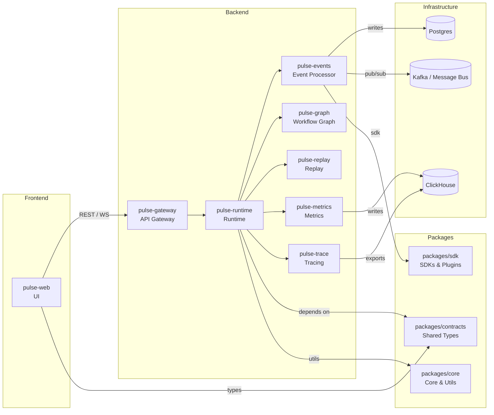
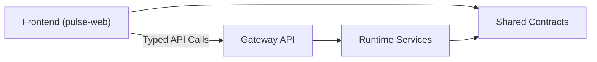
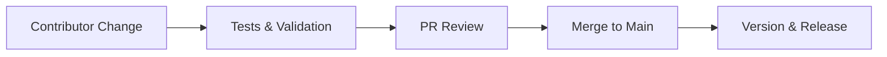
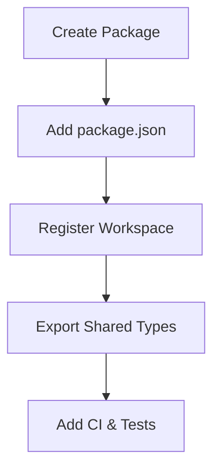
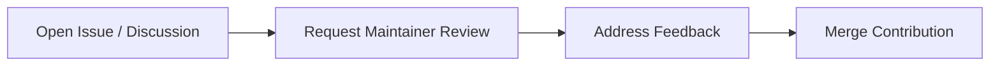

# Advanced Contributor Guide

This guide outlines the PulseStack monorepo structure, package responsibilities, shared contracts, development workflow, testing strategy, and contribution conventions.

### Repository Layout

* **Root** — Workspace configuration and monorepo tooling powered by `pnpm` and `turbo`.

  * `package.json`
  * `pnpm-workspace.yaml`
  * `turbo.json`

* **Apps (`apps/`)** — Deployable frontend and backend services.

  * `apps/pulse-web` → Frontend application
  * `apps/pulse-runtime` → Core runtime service

* **Packages (`packages/`)** — Shared reusable libraries.

  * `contracts` → Shared TypeScript types & interfaces
  * `core` → Runtime utilities & infrastructure logic
  * `plugin-sdk`, `sdk`, `ui` → SDKs, plugin APIs, and shared UI components

* **Infrastructure (`infra/`, `docker/`, `helm/`)** — Deployment and environment configuration.

  * Docker Compose setups
  * Kubernetes Helm charts
  * Infrastructure manifests

* **Proto (`proto/`)** — Shared protocol buffer schemas and cross-service contracts.

  * `proto/pulsestack.proto`

PulseStack follows a modular architecture focused on scalability, shared contracts, type safety, and clean separation between frontend, backend, and infrastructure layers.

**Architecture Overview**

Below is a high-level architecture diagram showing how the frontend, backend services, shared packages, and infra components interact. This is a living diagram — update it when major architectural boundaries change.


---

### Architecture Notes

* **Frontend** communicates through the **Gateway API** and should only depend on UI-safe packages and shared types from `packages/contracts`.
* **Runtime** acts as the central orchestrator, coordinating services like events, graph processing, replay, metrics, and tracing while interacting with infrastructure components.
* **Shared Packages** must remain dependency-clean. UI packages should never import backend-only runtime utilities or infrastructure logic.

---

## Package Responsibilities

| Package                                | Responsibility                                                                                   |
| -------------------------------------- | ------------------------------------------------------------------------------------------------ |
| `apps/*`                               | Runnable frontend apps and backend services with isolated development and build workflows        |
| `packages/contracts`                   | Canonical shared TypeScript types, schemas, and API contracts used across services               |
| `packages/core`                        | Core platform utilities including logging, runtime setup, infra wiring, and shared backend logic |
| `packages/plugin-sdk` / `packages/sdk` | Stable SDKs and extension APIs for plugins and external integrations                             |
| `plugins/*`                            | Third-party or example plugin implementations, manifests, and integrations                       |

Keep shared contracts stable, maintain clear frontend/backend boundaries, and prefer modular reusable packages over tightly coupled app-specific logic.

---

**Shared Types & Versioning Guidelines:**
- Use `packages/contracts` as the single source of truth for shared TypeScript types. Export stable types from [packages/contracts/src/index.ts](packages/contracts/src/index.ts).
- When changing shared types:
  - Prefer additive changes (new optional properties, new types) to maintain backwards compatibility.
  - If you must make breaking changes, coordinate a minor-major version bump and call out the migration steps in the PR description.
- For runtime protocol changes, update `proto/pulsestack.proto` and regenerate artifacts as appropriate for the consumers.

---

## Frontend / Backend Boundaries

### Frontend (`apps/pulse-web`)

Frontend applications should remain lightweight, modular, and UI-focused.

* Depend only on:

  * `packages/ui`
  * `packages/contracts`
* Avoid importing:

  * `packages/core`
  * Runtime or infrastructure-specific utilities
* Communicate exclusively through typed APIs and shared contracts

### Backend Services (`apps/pulse-*`)

Backend services handle orchestration, runtime execution, events, metrics, and infrastructure interactions.

* May depend on:

  * `packages/core`
  * `packages/contracts`
  * `packages/sdk`
* Must avoid importing UI-only modules or frontend-specific code

### Shared Contracts

API boundaries should remain explicit and type-safe through:

* `packages/contracts` → Shared TypeScript schemas
* `proto/` → Protocol buffer definitions and runtime contracts



---

# Development Workflow

## Local Setup

Install workspace dependencies:

```bash id="k8u4on"
pnpm install
```

Run a specific app or service:

```bash id="u0c9t2"
pnpm --filter pulse-web dev
pnpm --filter pulse-runtime dev
```

For infrastructure-dependent services, use:

```bash id="s1z8ef"
docker compose -f infra/docker/docker-compose.yml up
```

---

## Build Commands

Build a single package:

```bash id="3d9qpl"
pnpm --filter <package> build
```

Build the entire workspace:

```bash id="q7m2xn"
pnpm -w run build
```

PulseStack uses `turbo` + `pnpm` for incremental builds, task orchestration, and CI caching.

---

# Testing Strategy

### Unit Tests

* Located alongside source files
* Run per-package using:

```bash id="s4wnvo"
pnpm --filter <package> test
```

* Keep tests fast, isolated, and deterministic

---

### Integration Tests

* Validate runtime behavior and service interactions
* Prefer Docker Compose or TestContainers for infra-dependent testing
* Place tests near the owning service or package

---

### End-to-End Tests

* Exercise public APIs and real user flows
* Keep E2E suites isolated from internal implementation details

---

### Testing Responsibilities

| Change Type                  | Required Tests                 |
| ---------------------------- | ------------------------------ |
| `packages/contracts` updates | Contract & compatibility tests |
| `packages/core` changes      | Runtime & integration tests    |
| App/service features         | Integration or E2E coverage    |
| UI changes                   | Component & interaction tests  |

Contributors should ensure new functionality includes appropriate test coverage before opening a Pull Request.

---

# Contribution Conventions

## Branch Naming

Create branches from `main` using clear, scoped names:

```txt id="p7q4dn"
feature/auth-system
fix/runtime-memory-leak
chore/update-eslint-config
docs/improve-contributor-guide
```

---

## Commits & Pull Requests

* Keep commits small, focused, and atomic
* Prefer descriptive commit messages following conventional commits
* Link related issues and PRs where applicable
* Include:

  * Motivation
  * Change summary
  * Test plan
  * Migration notes (if needed)

### Example Commit Messages

```txt id="g3v9ka"
feat: add plugin event registry
fix: resolve websocket reconnect issue
docs: improve monorepo contributor guide
refactor: simplify runtime initialization
```

---

## Code Style & Linting

PulseStack follows consistent formatting and linting standards across the monorepo.

### Recommended Commands

```bash id="x6tmn1"
pnpm -w run format
pnpm --filter <package> lint
```

### Guidelines

* Use Prettier formatting
* Keep imports organized
* Prefer modular reusable utilities
* Avoid package boundary violations
* Maintain strict TypeScript safety

---

## Review Process

Pull Requests should be reviewed by contributors familiar with the affected domain:

| Area           | Suggested Reviewers            |
| -------------- | ------------------------------ |
| Frontend       | UI & design system maintainers |
| Backend        | Runtime & infra maintainers    |
| Contracts      | Shared API/schema maintainers  |
| SDKs & Plugins | Extension platform maintainers |

For breaking contract or SDK changes:

* Include migration guidance
* Document compatibility impacts
* Notify maintainers early

---

## Versioning & Publishing

Shared libraries follow **Semantic Versioning (SemVer)**.

| Change Type                   | Version Impact |
| ----------------------------- | -------------- |
| Bug fixes                     | Patch          |
| Backwards-compatible features | Minor          |
| Breaking changes              | Major          |

When modifying published packages:

* Update changelogs
* Bump versions appropriately
* Document migration steps



---

# Adding a New Package or App

## Quick Checklist

### 1. Create Package Structure

Add a new directory inside:

* `apps/` → Deployable services/apps
* `packages/` → Shared reusable libraries

Include a `package.json` with:

```json id="9m8z3q"
{
  "name": "package-name",
  "version": "0.0.1",
  "scripts": {
    "dev": "",
    "build": "",
    "test": ""
  }
}
```

---

### 2. Register Workspace

Ensure the package is included in:

* `pnpm-workspace.yaml`
* Turbo pipeline configuration (if required)

---

### 3. Export Shared Contracts

If adding reusable types:

* Export them from `packages/contracts`
* Avoid deep relative imports across packages
* Keep contracts backwards-compatible where possible

---

### 4. Configure CI & Caching

Add:

* Build steps
* Test pipelines
* Cache configuration
* Linting tasks

This ensures the package participates correctly in Turbo caching and CI workflows.



Well-structured packages improve scalability, maintainability, and developer experience across the entire PulseStack ecosystem.

---

# Getting Help & Review Ownership

Need help contributing? Start by opening a discussion or issue in the repository and provide clear context, logs, or reproduction steps where possible.

## Review Ownership

| Area                    | Recommended Maintainers               |
| ----------------------- | ------------------------------------- |
| Architecture & Runtime  | Core runtime maintainers              |
| Frontend & UI           | `pulse-web` and UI maintainers        |
| Contracts & APIs        | `packages/contracts` maintainers      |
| SDKs & Plugins          | `packages/sdk` and plugin maintainers |
| Infrastructure & DevOps | Infra and deployment maintainers      |

For changes affecting shared contracts, SDKs, or runtime behavior:

* Request reviews early
* Document compatibility impacts
* Include migration guidance for breaking changes



---

# Contributor Resources

Helpful contribution resources may include:

* `docs/CONTRIBUTING-CHECKLIST.md` → Local setup & development commands
* `README.md` → Project overview and quick start
* `docs/ARCHITECTURE.md` → System architecture and package boundaries
* CI workflows → Build, test, and release automation references

Contributors are encouraged to keep documentation updated alongside code changes to maintain consistency across the PulseStack ecosystem.
